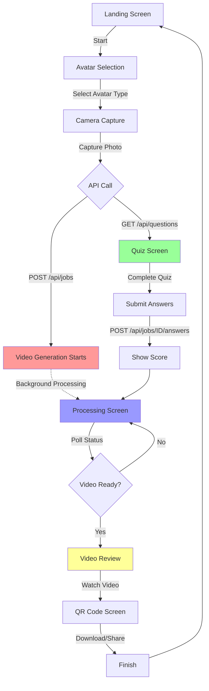
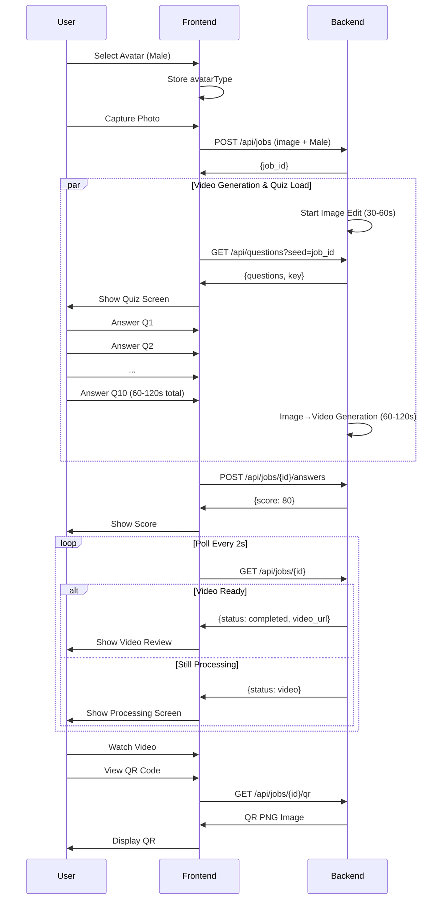

# UAE National Anthem Kiosk - Workflow Guide

## 🎯 Complete User Journey

This document illustrates the complete user journey through the UAE National Anthem Kiosk application, highlighting the parallel processing of video generation and quiz engagement.

---

## 📱 Screen Flow Diagram



---

## ⏱️ Timeline Analysis

### Parallel Processing Strategy

```
TIME:  0s        30s       60s       90s       120s      150s      180s
       |---------|---------|---------|---------|---------|---------|
       
User:  📸        ❓        ❓        ❓        ⏳        ▶️        📱
       Camera   Quiz Q1   Quiz Q5  Quiz Q10  Wait     Video    QR Code
       Capture  Started   Mid-way  Finished  (maybe)  Review   Download

API:   🚀                                               ✅
       Video                                           Video
       Job                                            Ready
       Created  |-------- Image Edit --------|
                                              |------- Video Gen -------|
       
       |<------- Quiz Engagement --------->|  |<- Wait ->|
       |<---------- Video Processing (90-180s) -------->|
```

### Timing Breakdown

| Phase | Duration | User Activity | Backend Status |
|-------|----------|---------------|----------------|
| **Camera** | 5-10s | Position face, capture | Idle |
| **API Call** | <1s | Loading... | Job created, processing starts |
| **Quiz** | 60-120s | Answer 10 questions | `status: "image"` → `status: "video"` |
| **Processing Screen** | 0-90s | Watching spinner | `status: "video"` → `status: "completed"` |
| **Video Review** | 30-60s | Watching video | Video ready |
| **QR Code** | 10-30s | Download/scan | Complete |

> [!TIP]
> **Optimal UX**: If the user takes ~90-120 seconds on the quiz (realistic for 10 questions), they may only wait 0-30 seconds on the processing screen before the video is ready!

---

## 🔄 Detailed Screen Workflows

### 1️⃣ Landing Screen
```
┌─────────────────────────────────────┐
│      🇦🇪 UAE National Anthem        │
│        AI Experience                │
│                                     │
│    [Start Experience]               │
└─────────────────────────────────────┘
```
- Simple welcome screen
- One button: "Start Experience"
- Navigate to Avatar Selection

---

### 2️⃣ Avatar Selection Screen
```
┌─────────────────────────────────────┐
│    Choose Your Avatar               │
│                                     │
│  👨  Male     👩  Female            │
│                                     │
│  👦  Boy      👧  Girl              │
│                                     │
│              [Next]                 │
└─────────────────────────────────────┘
```
- Display 4 avatar cards with images
- User selects ONE avatar
- Store `avatarType` in state
- Navigate to Camera Capture

**State Update**:
```javascript
{ avatarType: 'Male' } // or Female, Boy, Girl
```

---

### 3️⃣ Camera Capture Screen
```
┌─────────────────────────────────────┐
│    Position Your Face               │
│                                     │
│  ┌───────────────────────────────┐  │
│  │       📹 Video Feed           │  │
│  │      [Face Guide Oval]        │  │
│  └───────────────────────────────┘  │
│                                     │
│  ✓ Position face in center          │
│  ✓ Good lighting                    │
│  ✓ Look at camera                   │
│                                     │
│    [Back]    [Capture Photo]        │
└─────────────────────────────────────┘
```

**On Capture Photo**:
1. ✅ Convert canvas to Blob
2. ✅ Create FormData with image + avatarType
3. ✅ Call `POST /api/jobs` → receive `job_id`
4. ✅ Call `GET /api/questions?seed={job_id}` → receive questions
5. ✅ Store job_id, questions, quiz key in state
6. ✅ Navigate to Quiz Screen
7. 🎬 **Video generation now running in background!**

**API Calls**:
```javascript
// 1. Start video job
const formData = new FormData();
formData.append('image', photoBlob);
formData.append('age_group', avatarType); // 'Male'
const { job_id } = await createJob(formData);

// 2. Load quiz (in parallel)
const { questions, key } = await getQuestions(10, job_id);

// 3. Store in state
setJobId(job_id);
setQuizQuestions(questions);
setQuizKey(key);

// 4. Navigate
router.push('/quiz');
```

---

### 4️⃣ Quiz Screen (User Engagement)
```
┌─────────────────────────────────────┐
│    UAE National Day Quiz            │
│    Question 3 of 10                 │
│                                     │
│  When is UAE National Day?          │
│                                     │
│  ( ) 1 December                     │
│  (•) 2 December    ← Selected       │
│  ( ) 25 November                    │
│  ( ) 15 December                    │
│                                     │
│    [Back]           [Next]          │
└─────────────────────────────────────┘
```

**Question Navigation**:
- Show one question at a time
- Radio buttons for options (single choice)
- "Next" button advances to next question
- Last question shows "Submit" instead of "Next"

**On Submit**:
1. ✅ Call `POST /api/jobs/{job_id}/answers`
2. ✅ Receive score
3. ✅ Show score with celebration
4. ✅ Navigate to Processing Screen

**Score Display**:
```
┌─────────────────────────────────────┐
│            🎉 Great Job!            │
│                                     │
│      You scored 8/10 (80%)          │
│                                     │
│    ⭐⭐⭐⭐⭐⭐⭐⭐☆☆              │
│                                     │
│   Preparing your video...           │
└─────────────────────────────────────┘
```

**Important**: 
- 🎬 Video is **still processing** in background while user takes quiz
- ⏱️ Quiz takes 60-120s, video takes 90-180s
- 🎯 Quiz reduces perceived wait time!

---

### 5️⃣ Processing Screen (Polling)
```
┌─────────────────────────────────────┐
│    Creating Your Video              │
│                                     │
│         ⭕ Spinner                   │
│                                     │
│    [=========>----------] 65%       │
│                                     │
│    Generating video...              │
│                                     │
│  ✓ Processing your face             │
│  ✓ Analyzing your selection         │
│  ⏳ Generating video                │
│  ⏳ Adding final touches             │
└─────────────────────────────────────┘
```

**Polling Logic**:
```javascript
useEffect(() => {
  // Check immediately on mount
  const checkStatus = async () => {
    const status = await fetchJobStatus(jobId);
    
    if (status.status === 'completed') {
      setVideoUrl(status.video_url);
      router.push('/review');
    } else if (status.status === 'failed') {
      showError(status.error);
    } else {
      // Continue polling
      updateUIStatus(status.status); // 'image' or 'video'
    }
  };
  
  // Check immediately
  checkStatus();
  
  // Then poll every 2 seconds
  const interval = setInterval(checkStatus, 2000);
  
  return () => clearInterval(interval);
}, [jobId]);
```

**Status Mapping**:
- `"image"` → "Processing your face..."
- `"video"` → "Generating video..."
- `"completed"` → Navigate to review
- `"failed"` → Show error

**Best Case**: User arrives here after 90s quiz, video is already 50% done or complete!

---

### 6️⃣ Video Review Screen
```
┌─────────────────────────────────────┐
│    Your Personalized Video          │
│                                     │
│  ┌───────────────────────────────┐  │
│  │                               │  │
│  │      📹 Video Player          │  │
│  │      ▶️ Playing...            │  │
│  │                               │  │
│  │  [⏮️] [⏸️] [⏭️]  00:00 / 01:30 │  │
│  └───────────────────────────────┘  │
│                                     │
│            [Next]                   │
└─────────────────────────────────────┘
```

**Features**:
- HTML5 video player with controls
- Play, pause, replay functionality
- Shows video duration
- "Next" button goes to QR Code screen

**Implementation**:
```javascript
<video 
  src={videoUrl} 
  controls 
  autoPlay
  className="w-full rounded-lg"
/>
```

---

### 7️⃣ QR Code Screen (Final)
```
┌─────────────────────────────────────┐
│    Scan to Download                 │
│                                     │
│     ┌─────────────────┐             │
│     │█▀▀▀▀▀█ ▀▄█ █▀▀▀▀│             │
│     │█ ███ █ ██▄ █ ██ │             │
│     │█ ▀▀▀ █ █▄▀ █ ▀▀▀│             │
│     │▀▀▀▀▀▀▀ █ ▄ ▀ ▀▀▀│             │
│     │QR Code Image    │             │
│     └─────────────────┘             │
│                                     │
│    📱 Scan QR code with your phone  │
│         to download the video       │
│                                     │
│    [Download Video] [Save QR Code]  │
│              [Finish]               │
└─────────────────────────────────────┘
```

**Features**:
- Display QR code from `/api/jobs/{job_id}/qr`
- Download video button (direct link to `video_url`)
- Save QR code button (download PNG)
- Finish button (reset to landing)

**Implementation**:
```javascript


<a 
  href={videoUrl} 
  download={`uae-anthem-${jobId}.mp4`}
  className="btn"
>
  Download Video
</a>

<button onClick={handleSaveQR}>
  Save QR Code
</button>

<button onClick={() => router.push('/')}>
  Finish
</button>
```

---

## 🗄️ State Management Flow

### Global State (Zustand Store)

```javascript
{
  // Avatar Selection
  avatarType: 'Male' | 'Female' | 'Boy' | 'Girl',
  
  // Camera Capture
  capturedImage: Blob | null,
  
  // Video Generation
  jobId: string | null,
  videoUrl: string | null,
  qrUrl: string | null,
  processingStatus: 'idle' | 'processing' | 'completed' | 'failed',
  
  // Quiz
  quizQuestions: Array<Question>,
  quizKey: Array<QuestionWithAnswer>,
  quizAnswers: Array<number>,
  quizScore: { total: number, correct: number, score: number } | null,
  
  // Error Handling
  errorMessage: string | null,
}
```

### State Updates by Screen

| Screen | State Read | State Write |
|--------|-----------|-------------|
| Avatar Selection | - | `avatarType` |
| Camera | `avatarType` | `capturedImage`, `jobId`, `quizQuestions`, `quizKey` |
| Quiz | `quizQuestions`, `quizKey` | `quizAnswers`, `quizScore` |
| Processing | `jobId` | `videoUrl`, `qrUrl`, `processingStatus` |
| Video Review | `videoUrl` | - |
| QR Code | `jobId`, `videoUrl` | - |

---

## 🎨 Unified Background

**All screens use the same background**:

```css
.unified-background {
  background: linear-gradient(
    to bottom right,
    #00732F,  /* Emerald (UAE Green) */
    #000000,  /* Black */
    #FF0000   /* Red (UAE Red) */
  );
  min-height: 100vh;
  display: flex;
  align-items: center;
  justify-content: center;
}
```

**Tailwind classes**:
```
bg-gradient-to-br from-emerald-600 via-black to-red-600
```

This creates a consistent visual identity representing the UAE flag colors throughout the entire experience.

---

## 🔥 Key UX Insights

### Why Parallel Processing?

1. **Reduces Perceived Wait Time**: User is engaged with quiz instead of watching a spinner
2. **Best Case Scenario**: Video might be ready immediately after quiz
3. **Worst Case Scenario**: User only waits 30-60s after quiz instead of 90-180s total
4. **Educational Value**: Quiz teaches about UAE National Day while waiting

### Timeline Scenarios

**Fast Quiz Taker** (60 seconds):
```
0s: Capture → 1s: APIs called → 60s: Quiz done → 90s: Video ready
Wait time after quiz: 30 seconds
```

**Average Quiz Taker** (90 seconds):
```
0s: Capture → 1s: APIs called → 90s: Quiz done → 120s: Video ready
Wait time after quiz: 30 seconds
```

**Slow Quiz Taker** (120 seconds):
```
0s: Capture → 1s: APIs called → 120s: Quiz done → 120s: Video ready!
Wait time after quiz: 0 seconds! ✨
```

> [!TIP]
> The quiz is designed to take approximately the same time as video generation (90-120s), minimizing wait time on the processing screen!

---

## 📊 API Call Sequence



---

## ✅ Implementation Checklist

- [ ] Create unified background component
- [ ] Build avatar selection screen (4 avatars)
- [ ] Update camera screen:
  - [ ] Call POST /api/jobs after capture
  - [ ] Call GET /api/questions in parallel
  - [ ] Store job_id and quiz data
- [ ] Build quiz screen:
  - [ ] One question at a time
  - [ ] Submit answers endpoint
  - [ ] Show score with animation
- [ ] Update processing screen:
  - [ ] Real polling every 2s
  - [ ] Check status immediately on mount
  - [ ] Navigate when completed
- [ ] Build video review screen with player
- [ ] Build QR code screen:
  - [ ] Display QR image
  - [ ] Download video button
  - [ ] Save QR button
  - [ ] Finish button
- [ ] Update state management store
- [ ] Create API utility functions
- [ ] Add error handling throughout
- [ ] Test complete workflow

---

**Ready to build!** 🚀
